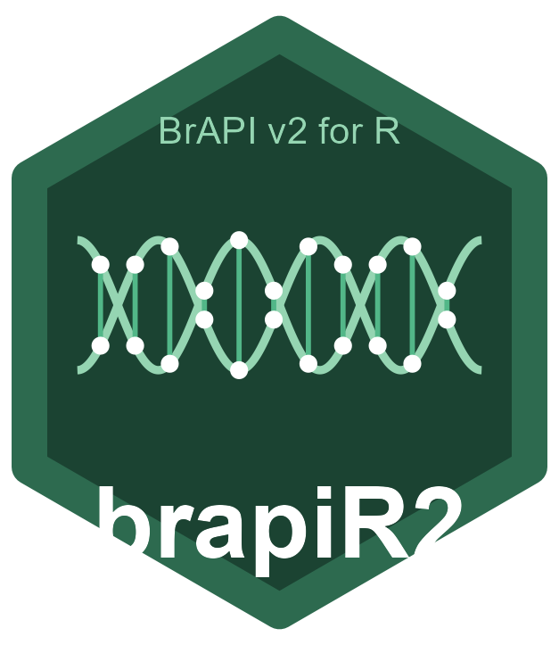

<!-- README.md is generated from README.Rmd. Please edit that file -->

```{r, include = FALSE}
knitr::opts_chunk$set(
  collapse = TRUE,
  comment = "#>",
  fig.path = "man/figures/README-",
  out.width = "100%"
)
```

# brapiR2 

<!-- badges: start -->
[](https://github.com/josh45-source/brapiR2/actions/workflows/R-CMD-check.yaml)
[](https://lifecycle.r-lib.org/articles/stages.html#experimental)
[](https://CRAN.R-project.org/package=brapiR2)
<!-- badges: end -->

**brapiR2** is a tidyverse-native, stateless R client for the [BrAPI v2](https://brapi.org/) (Breeding API) specification. It provides pipe-friendly access to **all four BrAPI modules** — Core, Germplasm, Phenotyping, and Genotyping — returning tidy tibbles ready for analysis.

Developed by **Joash Joshua Ayo** (<joashjoshua789@gmail.com>).

## Why brapiR2?

| Feature | brapiR2 | QBMS |
|---------|---------|------|
| Design | Stateless, functional, pipeable | Stateful, menu-driven |
| BrAPI v2 coverage | Full spec (all 4 modules) | Partial (phenotyping focus) |
| Genotyping support | Native variants, callsets, dosage matrix | Via GIGWA wrapper |
| Return type | Always tibbles | Mixed lists/dataframes |
| Auth | Unified token/OAuth2 | Engine-specific functions |
| Caching | Built-in response caching | Limited |

**brapiR2 complements [QBMS](https://cran.r-project.org/package=QBMS)** — use QBMS for interactive exploration, use brapiR2 for programmatic pipelines and custom tooling.

## Installation

Install the development version from GitHub:

```r
# install.packages("remotes")
remotes::install_github("josh45-source/brapiR2")
```

## Quick Start

```{r example, eval = FALSE}
library(brapiR2)
library(dplyr)

# 1. Connect (no global state!)
con <- brapi_connection("https://test-server.brapi.org")

# 2. Explore programs and trials
brapi_programs(con)

brapi_trials(con) |>
  filter(active == TRUE) |>
  head()

# 3. Get phenotypic data in analysis-ready wide format
data <- brapi_study_data(con, "study_01")

# 4. Get genotypic data as a dosage matrix for GS
dosage <- brapi_get_dosage_matrix(con, "variantset_01")

# 5. Parallel fetch across multiple studies
all_data <- brapi_fetch_parallel(
  con,
  brapi_study_data,
  ids = c("study_01", "study_02", "study_03"),
  .workers = 4
)
```

## Pipe-Friendly Design

Every function takes a connection object as its first argument and returns a tibble, making it natural to chain with dplyr:

```{r pipes, eval = FALSE}
con <- brapi_connection("https://my-breedbase.org", token = "my_token")

# Find all germplasm used in a specific study
brapi_observation_units(con, studyDbId = "study_42") |>
  select(germplasmDbId, germplasmName) |>
  distinct()

# Get marker positions for a genotyping dataset
brapi_get_marker_map(con, "my_variantset") |>
  filter(referenceName == "chr1") |>
  arrange(start)
```

## Supported BrAPI Modules

- **Core**: Programs, Trials, Studies, Locations, Seasons, Lists, People
- **Germplasm**: Germplasm, Pedigrees, Progeny, Attributes, Crosses, Seed Lots
- **Phenotyping**: Observation Units, Observations, Variables, Traits, Scales, Methods, Images, Events
- **Genotyping**: Samples, Variants, Variant Sets, Calls, Call Sets, References, Allele Matrix

## Authentication

```{r auth, eval = FALSE}
# Token-based (most BrAPI servers)
con <- brapi_connection("https://my-breedbase.org")
con <- brapi_login(con, "username", "password")

# OAuth 2.0 (EBS and similar)
con <- brapi_login_oauth2(
  con,
  client_id = "my_id",
  client_secret = "my_secret",
  authorize_url = "https://auth.example.org/authorize",
  access_url = "https://auth.example.org/token"
)

# Or set an existing token directly
con <- brapi_set_token(con, "my_existing_token")
```

## Related Packages

- [QBMS](https://cran.r-project.org/package=QBMS) — High-level, stateful BrAPI client for interactive use
- [rrBLUP](https://cran.r-project.org/package=rrBLUP) — Genomic selection (use brapiR2 to fetch the dosage matrix)
- [sommer](https://cran.r-project.org/package=sommer) — Mixed models for multi-environment trials

## Contributing

Contributions are welcome! Please see [CONTRIBUTING.md](CONTRIBUTING.md) for guidelines.

## License

MIT © Joash Joshua Ayo
