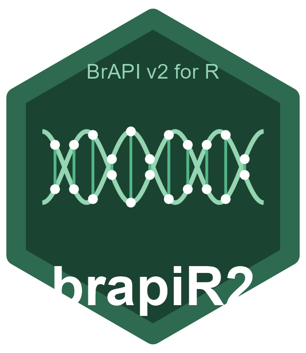

<!-- README.md is generated from README.Rmd. Please edit that file -->

# brapiR2 

<!-- badges: start -->

[](https://github.com/josh45-source/brapiR2/actions/workflows/R-CMD-check.yaml)
[](https://lifecycle.r-lib.org/articles/stages.html#experimental)
<!-- badges: end -->

**brapiR2** is a tidyverse-native, stateless R client for the [BrAPI
v2](https://brapi.org/) (Breeding API) specification. It provides
pipe-friendly, read-only access across all four BrAPI modules - Core,
Germplasm, Phenotyping, and Genotyping - wrapping 32 of the
specification’s 36 entities (56 of 138 retrieval endpoints) and
returning tidy tibbles ready for analysis.

Developed by **Joash Joshua Ayo** (<joashjoshua789@gmail.com>).

## Why brapiR2?

| Feature | brapiR2 | QBMS |
|----|----|----|
| Design | Stateless, functional, pipeable | Stateful, menu-driven |
| BrAPI v2 coverage | 32/36 entities, all 4 modules, read-only | Partial (phenotyping focus) |
| Genotyping support | Native variants, callsets, dosage matrix | Via GIGWA wrapper |
| Return type | Always tibbles | Mixed lists/dataframes |
| Auth | Unified token/OAuth2 | Engine-specific functions |
| Caching | Built-in response caching | Limited |

**brapiR2 complements
[QBMS](https://cran.r-project.org/package=QBMS)** - use QBMS for
interactive exploration, use brapiR2 for programmatic pipelines and
custom tooling.

[brapir-v2](https://github.com/mverouden/brapir-v2) is another R client
that, like brapiR2, targets the BrAPI v2 specification directly rather
than v1. Its own README describes it as still under development, and the
repository has had no commits in roughly four years (last pushed April
2022) - it does not appear to be actively maintained.

[BrAPI.R](https://github.com/TriticeaeToolbox/BrAPI.R) (David Waring,
Cornell) is a different kind of tool entirely, and complementary rather
than competing: its own DESCRIPTION calls it “simple wrapper functions
for httr that make it easier to make manual HTTP calls to a BrAPI
server”, and its README is explicit that it “does not have any knowledge
of the currently supported BrAPI endpoints”. It’s a transport layer -
callers pass endpoint paths as strings (`GET`, `POST`, and `PUT` are all
supported, plus a two-step search helper) and get back raw nested lists,
with a version argument that switches between BrAPI v1 and v2. It also
ships Breedbase-specific functions explicitly outside the BrAPI spec.
brapiR2 takes the opposite approach - named per-endpoint functions
returning tibbles - and covers less ground on writes: BrAPI.R’s
`POST`/`PUT` support covers exactly the write operations brapiR2
deliberately omits.

## Installation

Install the development version from GitHub:

``` r
# install.packages("remotes")
remotes::install_github("josh45-source/brapiR2")
```

## Quick Start

``` r
library(brapiR2)
library(dplyr)

# 1. Connect (no global state!)
con <- brapi_connection("https://test-server.brapi.org")

# 2. Explore programs and trials
brapi_programs(con)

brapi_trials(con) |>
  filter(active == TRUE) |>
  head()

# 3. Get phenotypic data in analysis-ready wide format
data <- brapi_study_data(con, "study_01")

# 4. Get genotypic data as a dosage matrix for GS
dosage <- brapi_get_dosage_matrix(con, "variantset_01")

# 5. Parallel fetch across multiple studies - set the backend yourself;
#    brapi_fetch_parallel() uses whatever plan is active rather than
#    setting one for you
future::plan(future::multisession, workers = 4)
all_data <- brapi_fetch_parallel(
  con,
  brapi_study_data,
  ids = c("study_01", "study_02", "study_03")
)
future::plan(future::sequential) # shut the workers back down when done
```

## Pipe-Friendly Design

Every function takes a connection object as its first argument and
returns a tibble, making it natural to chain with dplyr:

``` r
con <- brapi_connection("https://my-breedbase.org", token = "my_token")

# Find all germplasm used in a specific study
brapi_observation_units(con, studyDbId = "study_42") |>
  select(germplasmDbId, germplasmName) |>
  distinct()

# Get marker positions for a genotyping dataset - from the Genome Maps
# entity (a marker's position on a named map), not from Variant's own
# assembly coordinates, which many servers leave unpopulated
brapi_get_marker_map(con, variantSetDbId = "my_variantset") |>
  filter(linkageGroupName == "chr1") |>
  arrange(position)
```

## Supported BrAPI Modules

brapiR2 wraps 32 of the 36 BrAPI v2.1 entities (56 of 138 retrieval
endpoints) across all four modules:

- **Core**: Programs, Trials, Studies, Locations, Seasons, Lists, People
- **Germplasm**: Germplasm, Progeny, Attributes, Crosses, Seed Lots, and
  Pedigree - both single-germplasm (`brapi_germplasm_pedigree()`) and
  batch/tree retrieval across many germplasm at once
  (`brapi_pedigree()`, `brapi_search_pedigree()`)
- **Phenotyping**: Observation Units, Observations, Variables, Traits,
  Scales, Methods, Ontologies, Images, Events
- **Genotyping**: Samples, Variants, Variant Sets, Calls, Call Sets,
  References, Allele Matrix, Genome Maps

Not yet covered: Common Crop Names, Germplasm Attribute Values, Plates,
and Vendor (lab/vendor order-tracking endpoints). brapiR2 is read-only
by design - it does not implement BrAPI’s `POST`/`PUT` write endpoints.

## Authentication

``` r
# Token-based (most BrAPI servers)
con <- brapi_connection("https://my-breedbase.org")
con <- brapi_login(con, "username", "password")

# OAuth 2.0 (EBS and similar)
con <- brapi_login_oauth2(
  con,
  client_id = "my_id",
  client_secret = "my_secret",
  authorize_url = "https://auth.example.org/authorize",
  access_url = "https://auth.example.org/token"
)

# Or set an existing token directly
con <- brapi_set_token(con, "my_existing_token")
```

## Related Packages

- [QBMS](https://cran.r-project.org/package=QBMS) — High-level, stateful
  BrAPI client for interactive use
- [rrBLUP](https://cran.r-project.org/package=rrBLUP) — Genomic
  selection (use brapiR2 to fetch the dosage matrix)
- [sommer](https://cran.r-project.org/package=sommer) — Mixed models for
  multi-environment trials

## Contributing

Contributions are welcome! Please see [CONTRIBUTING.md](CONTRIBUTING.md)
for guidelines.

## License

MIT © Joash Joshua Ayo
